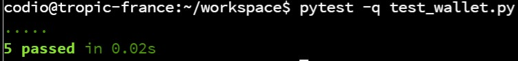

# Codio Activity: pytest

The following task involves experimenting with pytest using the Python programming language.

Run the tests using the command:

```bash
pytest -q test_wallet.py 
```

You should see the following output:



Amend the code so that the tests fail.